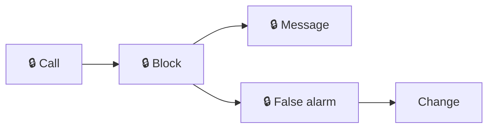
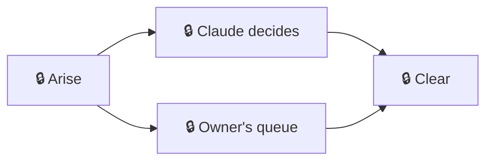
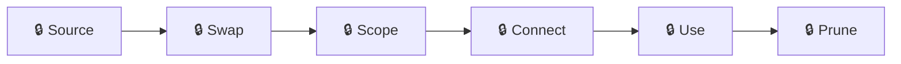

# Process maps

Three maps for an agent-driven repo, each step held to one metric. Use them on your Process page with `{ "use": "guard" }`, `{ "use": "decide" }` and `{ "use": "equip" }` once the pack is in your `quality/config.json` `packs` ([README](../README.md#quickstart)). Steps marked 🔒 read the machine that runs the sessions, so they show only on a `--local` page.

## Guard: a tool call, through the guards, to run or blocked

```mermaid
flowchart LR
  call["🔒 Call"] --> block["🔒 Block"] --> message["🔒 Message"]
  block --> fa["🔒 False alarm"] --> change["Change"]
```

| Step | Ideal | Metric |
|---|---|---|
| Call | Auto mode and deny rules stop one-way doors; with no guard log, their refusals are the count | `blockers.guard_blocks_per_100_calls` |
| Block | A block names its fix, so the session moves on in seconds | `blockers.latest_block_seconds` |
| Message | The rule and the fix, nothing more | `blockers.latest_block_tokens` |
| False alarm | A block on a safe command becomes a guard test | `blockers.guard_false_alarm_share` |
| Change | A rule change lands with one regression case | `blockers.enforcement_reverts` (public) |

## Decide: a question or blocker, to Claude's call or the owner's queue

```mermaid
flowchart LR
  arise["🔒 Arise"] --> decide["🔒 Claude decides"] --> clear["🔒 Clear"]
  arise --> queue["🔒 Owner's queue"] --> clear
```

| Step | Ideal | Metric |
|---|---|---|
| Arise | Surfaces once with its fix named | `blockers.costly` |
| Claude decides | Decides within its delegation, records reason and reversal in the PR | `blockers.latest_block_tokens` |
| Owner's queue | Only questions and human steps reach the owner | `claude_settings.prompts_per_100_calls` |
| Clear | Each false block becomes a guard fix by PR | `blockers.guard_false_alarm_share` |

## Equip: a capability, from Anthropic's plugins to a lean session

```mermaid
flowchart LR
  source["🔒 Source"] --> swap["🔒 Swap"] --> scope["🔒 Scope"] --> connect["🔒 Connect"] --> use["🔒 Use"] --> prune["🔒 Prune"]
```

| Step | Ideal | Metric |
|---|---|---|
| Source | 🅰 official marketplaces or 🅱 Anthropic's reviewed directory; anything else named | `desktop_app.plugins_untrusted` |
| Swap | A custom skill, agent, hook or plugin gives way to Anthropic's | `desktop_app.plugins_replaceable` |
| Scope | Domain plugins on in the repos that use them | `desktop_app.listing_tokens` |
| Connect | Every listed connector signed in before the first prompt | `desktop_app.connectors_pending` |
| Use | Every enabled plugin called in the account's recent sessions | `desktop_app.plugins_unused` |
| Prune | Turned-off, orphaned, delisted, unmaintained installs uninstalled | `desktop_app.plugins_stale` |

| Tier | Marketplace name | Rule |
|---|---|---|
| 🅰 Anthropic | `claude-plugins-official`, `knowledge-work-plugins`, `claude-for-legal`, `claude-for-financial-services`, `life-sciences` … | ✅ prefer |
| 🅱 Reviewed | Anthropic's directory on claude.ai (`anthropic-plugin-directory` in the desktop app) | ✅ allow |
| 🅲 Community | `claude-community` | ⚠️ no 🅰/🅱 equivalent only |
| 🅳 Third-party | everything else | ❌ swap, or name a reason in `kept_plugins` |

Tiers follow [plugin security](https://code.claude.com/docs/en/plugins/security) (read 2026-11-14): Claude Code accepts the official and community names only from `github.com/anthropics/`. Equivalents: [`collectors/desktop-app/anthropic-equivalents.json`](../collectors/desktop-app/anthropic-equivalents.json).

Source of truth: [`guard.json`](guard.json), [`decide.json`](decide.json), [`equip.json`](equip.json).
